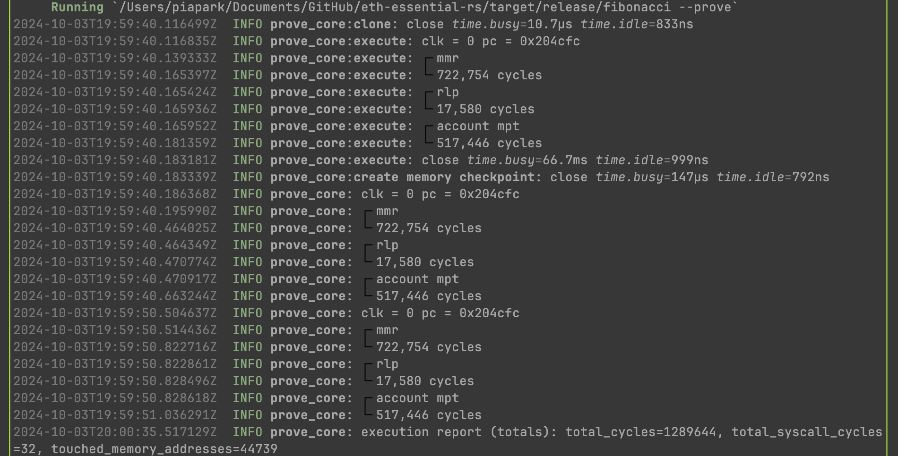

### Building blocks

- [x] Header verification - MMR proof
- [x] Account verification - MPT proof
- [ ] Storage verification - MPT proof
- [ ] Tx / Receipt verification - MPT proof

## funfact

### mmr + rlp decode + mpt account - keccak

[example fixture](./script/keccak-test.json)



### keccak (precompile) - mmr

```
cycles=856190 gas=997724 e2e=89.702300427s khz=9.54 proofSize=3544020
```

### stark hash - mmr

```
cycles=20277801 gas=23727089 e2e=596.959s khz=33.97 proofSize=32741592
```

### Build & Run

```sh
cd program && cargo prove build
```

```sh
cd script && cargo run --release -- --execute
```

This will execute the program and display the output.

### Generate a Core Proof

To generate a core proof for your program:

```sh
cd script
cargo run --release -- --prove
```
